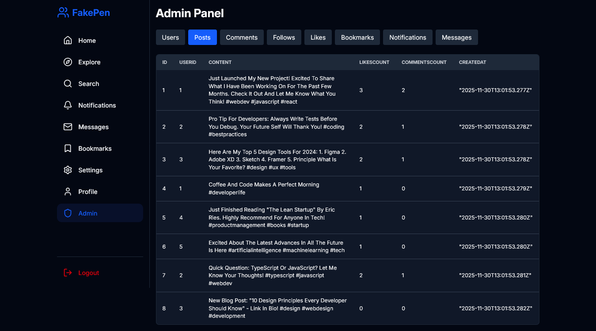
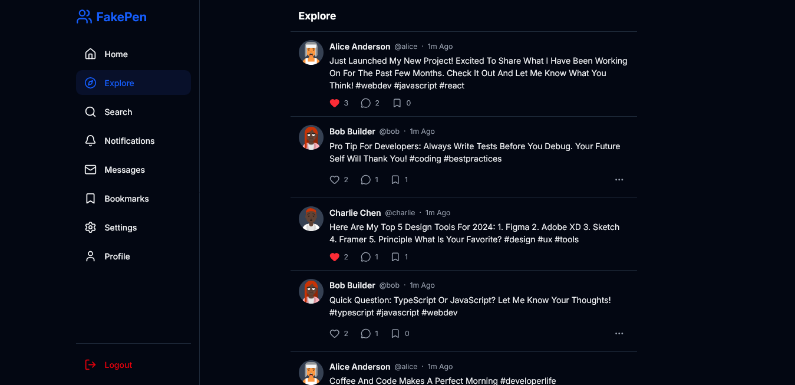
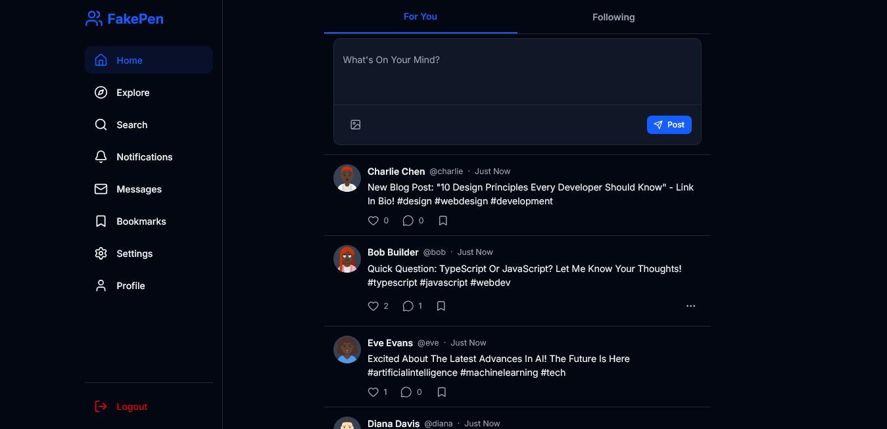
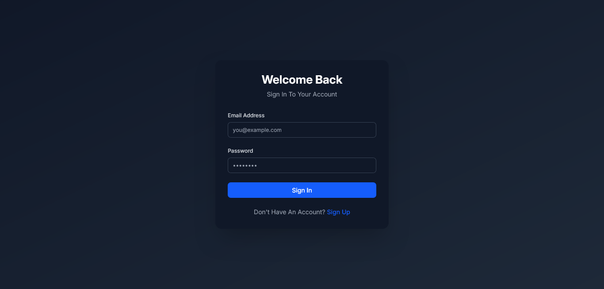
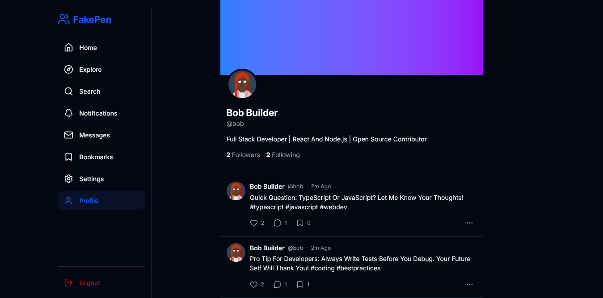
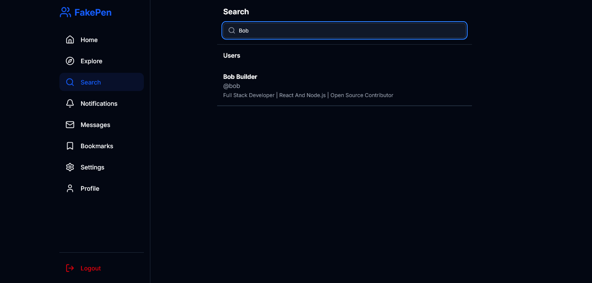
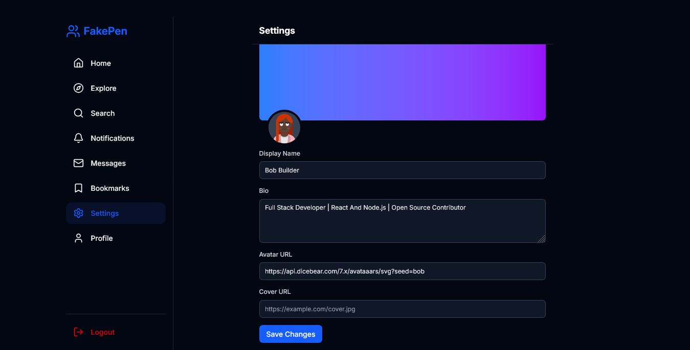

# Fake Pen Project Documentation

## Introduction

This Document Serves As The Comprehensive Technical Documentation For The Fake Pen Application. Fake Pen Is A Modern Social Media Platform Designed To Connect People & Enable Them To Share Their Thoughts, Images, & Experiences. The Application Is Built Using A Robust Tech Stack That Prioritizes Performance, Scalability, & User Experience. This Documentation Covers Every Aspect Of The System, From The Database Schema & Backend Services To The Frontend User Interface & State Management.

## Technology Stack

The Application Is Built Upon A Foundation Of Modern Web Technologies.

### Core Framework

The Core Framework Used Is React Router 7. This Framework Provides The Routing Capabilities & Server Side Rendering Features That Power The Application. It Allows For Seamless Navigation Between Pages & Efficient Data Loading Through Loaders & Actions.

### Language

The Entire Codebase Is Written In Typescript. Typescript Adds Static Typing To Javascript, Which Enhances Code Quality, improve Developer Productivity, & Reduces Runtime Errors. All Components, Functions, & Data Structures Are Strictly Typed.

### Database & Object Relational Mapping

The Application Uses Sqlite As The Primary Database Management System. Sqlite Is A Lightweight, File Based Database That Is Ideal For Development & Small To Medium Scale Deployments. To Interact With The Database, The Application Utilizes Prisma. Prisma Is A Modern Object Relational Mapping Tool That Provides A Type Safe Database Client. It Simplifies Database Queries & Schema Management.

### Styling

Styling Is Handled Using Tailwind Css. Tailwind Css Is A Utility First Css Framework That Allows For Rapid User Interface Development. It Provides A Set Of Predefined Classes That Can Be Composed To Build Complex Designs Without Leaving The Html. The Application Also Uses A Custom Design System With Variables For Colors, Fonts, & Spacing Defined In The Global Css File.

### User Interface Components

The User Interface Is Built Using React Components. The Application Utilizes A Component Library Architecture, Where Reusable Ui Elements Like Buttons, Inputs, & Dialogs Are Defined In A Shared Directory. Icons Are Provided By Lucide React, A Library Of Beautiful & Consistent Svg Icons.

### Text Editor

For Content Creation, The Application Integrates Tiptap. Tiptap Is A Headless Wrapper Around Prose Mirror, Providing A Rich Text Editing Experience. It Allows Users To Format Text, Add Links, & Structure Their Posts Effectively.

### Data Visualization

The Admin Dashboard Features Data Visualization Powered By Recharts. Recharts Is A Composable Charting Library Built On React Components. It Is Used To Display Analytics Such As User Growth, Post Activity, & Engagement Trends.

## Project Structure

The Project Follows A Structured Directory Layout To Organize Code Logically.

### App Directory

The App Directory Contains The Source Code For The Application.

#### Components Directory

The Components Directory Houses All The React Components Used In The Application. It Is Further Divided Into Subdirectories Based On Functionality.

##### Comments Directory

This Directory Contains Components Related To Post Comments.
*   **Comment**: Displays A Single Comment With Author Information & Content.
*   **Comment Input**: A Form For Users To Submit New Comments.
*   **Comment List**: A Container That Renders A List Of Comment Components.

##### Common Directory

This Directory Contains Generic Components Used Across The Application.
*   **Empty State**: A Component Displayed When There Is No Data To Show.

##### Feed Directory

This Directory Contains Components For The Main Content Feeds.
*   **Following Feed**: Renders A Feed Of Posts From Users That The Current User Follows.
*   **For You Feed**: Renders An Algorithmic Feed Of Posts From All Users.

##### Layout Directory

This Directory Contains Components That Define The Overall Layout Of The Application.
*   **Root Layout**: The Main Wrapper That Includes The Sidebar & Main Content Area.
*   **Sidebar**: The Left Navigation Menu Containing Links To Different Sections Of The App.
*   **Trends Sidebar**: The Right Sidebar Displaying Trending Hashtags.

##### Messages Directory

This Directory Contains Components For The Messaging System.
*   **Message List**: Displays A List Of Conversations Or Messages.

##### Notifications Directory

This Directory Contains Components For User Notifications.
*   **Notification Card**: Displays A Single Notification Item.

##### Posts Directory

This Directory Contains Components Related To User Posts.
*   **Image Gallery**: A Component To Display Multiple Images In A Grid Layout With A Lightbox.
*   **Post**: The Main Component For Displaying A User Post.
*   **Post Card**: A Simplified Version Of The Post Component For Lists & Feeds.
*   **Post Editor**: The Rich Text Editor For Creating New Posts.

##### Ui Directory

This Directory Contains Low Level User Interface Elements.
*   **Button**: A Reusable Button Component With Different Variants & Sizes.
*   **Dialog**: A Modal Dialog Component For Overlays.
*   **Input**: A Text Input Component.
*   **Loading**: Components For Loading States Including Skeletons.
*   **Textarea**: A Multi Line Text Input Component.
*   **Toast**: A Notification Component For Temporary Messages.

##### User Directory

This Directory Contains Components Related To User Profiles.
*   **Follow Button**: A Button To Follow Or Unfollow A User.
*   **User Avatar**: Displays A User Profile Picture.
*   **User Card**: Displays A Summary Of User Information.

#### Db Directory

The Db Directory Contains Database Configuration & Scripts.
*   **Client Server**: Initializes & Exports The Prisma Client Instance.
*   **Seed**: A Script To Populate The Database With Initial Mock Data.

#### Hooks Directory

The Hooks Directory Contains Custom React Hooks.
*   **Use Debounce**: A Hook To Delay The Execution Of A Function Or State Update.

#### Routes Directory

The Routes Directory Defines The Application Routes & Api Endpoints. Each File Corresponds To A Url Path.

*   **Index**: The Home Page Displaying The User Feed.
*   **Admin**: The Main Admin Dashboard Page.
*   **Admin Analytics**: A Page Displaying Statistical Data & Charts.
*   **Admin Comments**: A Page For Managing User Comments.
*   **Admin Posts**: A Page For Managing User Posts.
*   **Admin Users**: A Page For Managing Registered Users.
*   **Api Comments Create**: An Endpoint To Handle Comment Creation.
*   **Api Comments Delete**: An Endpoint To Handle Comment Deletion.
*   **Api Feed Following**: An Endpoint To Fetch Posts For The Following Feed.
*   **Api Feed For You**: An Endpoint To Fetch Posts For The For You Feed.
*   **Api Posts Bookmark**: An Endpoint To Toggle Bookmarks On Posts.
*   **Api Posts Create**: An Endpoint To Handle Post Creation.
*   **Api Posts Delete**: An Endpoint To Handle Post Deletion.
*   **Api Posts Like**: An Endpoint To Toggle Likes On Posts.
*   **Api Users Follow**: An Endpoint To Handle User Follow Actions.
*   **Bookmarks**: A Page Displaying The Current User Bookmarked Posts.
*   **Explore**: A Page Displaying Popular Content From Across The Platform.
*   **Hashtag**: A Page Displaying Posts Associated With A Specific Hashtag.
*   **Login**: The User Authentication Page.
*   **Logout**: An Action Route To Handle User Logout.
*   **Messages**: A Page For Viewing & Sending Direct Messages.
*   **Notifications**: A Page Displaying User Notifications.
*   **Posts Detail**: A Page Displaying A Single Post & Its Comments.
*   **Posts Interactions**: A Page Displaying Users Who Liked Or Bookmarked A Post.
*   **Search**: A Page For Searching Users & Posts.
*   **Settings**: A Page For Updating User Profile Information.
*   **Signup**: The User Registration Page.
*   **Users Profile**: The Public Profile Page Of A User.
*   **Users Likes**: A Page Displaying Posts Liked By A User.
*   **Users Connections**: A Page Displaying Followers Or Following Lists.

#### Services Directory

The Services Directory Contains Business Logic & External Services.
*   **Auth Server**: Handles Authentication Logic Including Password Hashing & Session Management.

#### Styles Directory

The Styles Directory Contains Global Stylesheets.
*   **Editor Css**: Styles Specific To The Tiptap Editor.
*   **Global Css**: The Main Stylesheet Including Tailwind Directives.

#### Utils Directory

The Utils Directory Contains Helper Functions & Utilities.
*   **Env Server**: Utilities For Accessing Environment Variables Safely.
*   **Formatters**: Functions For Formatting Dates & Numbers.
*   **Validation**: Zod Schemas For Validating User Input.

## Database Schema

The Database Schema Is Defined Using Prisma Schema Definition Language. It Consists Of Several Models That Represent The Entities In The Application.

### User Model

The User Model Represents A Registered User Of The Platform.
*   **Id**: A Unique Integer Identifier For The User.
*   **Username**: A Unique String Used For Login & Profile Urls.
*   **Email**: A Unique String Used For Communication & Login.
*   **Password**: A Hashed String Storing The User Password.
*   **Display Name**: A String Representing The User Public Name.
*   **Bio**: An Optional String For The User Biography.
*   **Avatar Url**: An Optional String Pointing To The User Profile Picture.
*   **Cover Url**: An Optional String Pointing To The User Cover Image.
*   **Is Admin**: A Boolean Flag Indicating If The User Has Administrative Privileges.
*   **Created At**: A Timestamp Marking When The Account Was Created.
*   **Updated At**: A Timestamp Marking When The Account Was Last Updated.

### Post Model

The Post Model Represents A Content Item Created By A User.
*   **Id**: A Unique Integer Identifier For The Post.
*   **User Id**: A Foreign Key Linking To The Author Of The Post.
*   **Content**: A String Containing The Html Content Of The Post.
*   **Media Urls**: A String Storing A Json Array Of Image Urls.
*   **Likes Count**: An Integer Tracking The Number Of Likes.
*   **Comments Count**: An Integer Tracking The Number Of Comments.
*   **Bookmarks Count**: An Integer Tracking The Number Of Bookmarks.
*   **Created At**: A Timestamp Marking When The Post Was Created.
*   **Updated At**: A Timestamp Marking When The Post Was Last Updated.

### Comment Model

The Comment Model Represents A Text Response To A Post.
*   **Id**: A Unique Integer Identifier For The Comment.
*   **Post Id**: A Foreign Key Linking To The Parent Post.
*   **User Id**: A Foreign Key Linking To The Author Of The Comment.
*   **Content**: A String Containing The Text Of The Comment.
*   **Created At**: A Timestamp Marking When The Comment Was Created.
*   **Updated At**: A Timestamp Marking When The Comment Was Last Updated.

### Like Model

The Like Model Represents A User Expression Of Approval For A Post.
*   **Id**: A Unique Integer Identifier For The Like.
*   **Post Id**: A Foreign Key Linking To The Liked Post.
*   **User Id**: A Foreign Key Linking To The User Who Liked The Post.
*   **Created At**: A Timestamp Marking When The Like Was Created.

### Bookmark Model

The Bookmark Model Represents A User Saving A Post For Later.
*   **Id**: A Unique Integer Identifier For The Bookmark.
*   **Post Id**: A Foreign Key Linking To The Bookmarked Post.
*   **User Id**: A Foreign Key Linking To The User Who Bookmarked The Post.
*   **Created At**: A Timestamp Marking When The Bookmark Was Created.

### Follow Model

The Follow Model Represents A Unidirectional Relationship Between Two Users.
*   **Id**: A Unique Integer Identifier For The Follow Relationship.
*   **Follower Id**: A Foreign Key Linking To The User Who Is Following.
*   **Following Id**: A Foreign Key Linking To The User Being Followed.
*   **Created At**: A Timestamp Marking When The Relationship Was Established.

### Notification Model

The Notification Model Represents An Alert For A User.
*   **Id**: A Unique Integer Identifier For The Notification.
*   **User Id**: A Foreign Key Linking To The Recipient Of The Notification.
*   **Actor Id**: A Foreign Key Linking To The User Who Triggered The Notification.
*   **Type**: A String Specifying The Type Of Notification Such As Like Or Follow.
*   **Post Id**: An Optional Foreign Key Linking To A Related Post.
*   **Content**: A String Describing The Notification.
*   **Is Read**: A Boolean Flag Indicating If The Notification Has Been Viewed.
*   **Created At**: A Timestamp Marking When The Notification Was Created.

### Message Model

The Message Model Represents A Private Communication Between Users.
*   **Id**: A Unique Integer Identifier For The Message.
*   **Sender Id**: A Foreign Key Linking To The User Sending The Message.
*   **Receiver Id**: A Foreign Key Linking To The User Receiving The Message.
*   **Content**: A String Containing The Message Body.
*   **Is Read**: A Boolean Flag Indicating If The Message Has Been Read.
*   **Created At**: A Timestamp Marking When The Message Was Sent.

## Core Features

The Application Provides A Wide Range Of Features To Facilitate Social Interaction.

### Authentication System

The Authentication System Is Secure & Robust. It Uses Bcrypt For Hashing Passwords Before Storing Them In The Database. User Sessions Are Managed Using Http Only Cookies To Prevent Cross Site Scripting Attacks. The System Supports User Registration, Login, & Logout. Access Control Middleware Ensures That Protected Routes Are Only Accessible To Authenticated Users.

### Feed System

The Feed System Is The Central Hub Of The Application. It Provides Two Distinct Views. The For You Feed Uses An Algorithm To Display The Most Recent & Engaging Posts From All Users. The Following Feed Displays Posts Only From Users That The Current User Follows. Both Feeds Support Infinite Scrolling To Provide A Seamless Browsing Experience.

### Post Creation & Management

Users Can Create Rich Text Posts Using The Integrated Editor. The Editor Supports Text Formatting & Image Uploads. Images Are Converted To Base Sixty Four Strings For Storage. Users Can Also Delete Their Own Posts. The System Tracks Engagement Metrics Such As Likes & Comments In Real Time.

### Social Interactions

The Platform Supports Various Social Interactions. Users Can Like Posts To Show Appreciation. They Can Bookmark Posts To Save Them For Later Viewing. Users Can Also Comment On Posts To Engage In Discussions. The Follow System Allows Users To Subscribe To Content From Specific Creators.

### User Profiles

Each User Has A Public Profile Page. This Page Displays Their Avatar, Cover Image, Bio, & A Feed Of Their Posts. It Also Shows Counts For Followers & Following. Users Can Edit Their Profile Information Including Their Display Name & Bio Through The Settings Page.

### Search Functionality

The Search Feature Allows Users To Find Content & People. It Supports Searching For Users By Username Or Display Name. It Also Supports Searching For Posts By Content. The Search Results Are Categorized Into Users & Posts For Easy Navigation.

### Notifications System

The Notification System Keeps Users Informed About Activity Related To Them. Users Receive Notifications When Someone Likes Their Post, Comments On Their Post, Or Follows Them. The System Tracks Read Status To Highlight New Notifications.

### Admin Dashboard

The Admin Dashboard Provides Powerful Tools For Platform Management. It Includes An Analytics Overview Displaying Key Metrics Like Total Users, Posts, & Engagement. It Also Provides Data Tables For Managing Users, Posts, & Comments. Administrators Can Delete Content Or Ban Users If Necessary.

## Installation & Setup

To Run This Project Locally, Follow These Steps.

### Prerequisites

Ensure That Node Js Is Installed On Your Machine. You Will Also Need A Package Manager Such As Npm.

### Clone The Repository

Download The Source Code To Your Local Machine.

### Install Dependencies

Run The Command To Install All Required Dependencies Defined In The Package Json File.

### Database Setup

Initialize The Sqlite Database Using Prisma. Run The Following Commands.
npx prisma generate
npx prisma db push
npm run seed

### Start The Development Server

Run The Command.
npm run dev
The Application Will Be Accessible At The Localhost Address Provided In The Terminal.

## Configuration

The Application Uses Environment Variables For Configuration. These Variables Should Be Defined In A Dot Env File In The Root Directory.

### Session Secret

A Secret Key Used To Sign Session Cookies. This Should Be A Long, Random String To Ensure Security.

### Node Environment

Defines The Environment In Which The Application Is Running. Set This To Development For Local Testing & Production For Deployment.

## Contributing

Contributions To The Project Are Welcome. Please Follow The Coding Standards Defined In The Project. Ensure That All New Code Is Typed & Documented. Run The Test Suite Before Submitting Any Changes.

## License

This Project Is Proprietary Software. All Rights Are Reserved. Unauthorized Copying Or Distribution Of This Code Is Strictly Prohibited.

## Project Gallery

